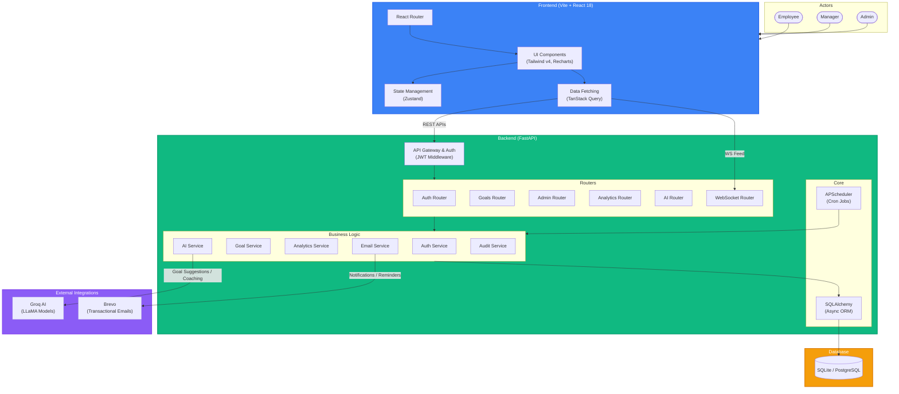

# GoalFlow Architecture

Below is the high-level architecture diagram for the GoalFlow Enterprise Portal.

```mermaid
flowchart TB
    %% External Users
    subgraph Users ["Actors"]
        Employee([Employee])
        Manager([Manager])
        Admin([Admin])
    end

    %% Frontend Components
    subgraph Frontend ["Frontend (Vite + React 18)"]
        UI["UI Components\n(Tailwind v4, Recharts)"]
        State["State Management\n(Zustand)"]
        Query["Data Fetching\n(TanStack Query)"]
        Router["React Router"]
        
        Router --> UI
        UI --> State
        UI --> Query
    end

    %% Backend Components
    subgraph Backend ["Backend (FastAPI)"]
        API_Gate["API Gateway & Auth\n(JWT Middleware)"]
        
        subgraph Routers ["Routers"]
            AuthR["Auth Router"]
            GoalsR["Goals Router"]
            AdminR["Admin Router"]
            AnalyticsR["Analytics Router"]
            AIR["AI Router"]
            WSR["WebSocket Router"]
        end
        
        subgraph Services ["Business Logic"]
            AuthS["Auth Service"]
            GoalS["Goal Service"]
            AnalyticsS["Analytics Service"]
            AIS["AI Service"]
            EmailS["Email Service"]
            AuditS["Audit Service"]
        end
        
        subgraph Core ["Core"]
            Scheduler["APScheduler\n(Cron Jobs)"]
            ORM["SQLAlchemy\n(Async ORM)"]
        end

        API_Gate --> Routers
        Routers --> Services
        Services --> ORM
        Scheduler --> Services
    end

    %% Database
    subgraph DB ["Database"]
        SQLite[(SQLite / PostgreSQL)]
    end

    %% External Services
    subgraph ThirdParty ["External Integrations"]
        Groq["Groq AI\n(LLaMA Models)"]
        Brevo["Brevo\n(Transactional Emails)"]
    end

    %% Connections
    Employee --> Frontend
    Manager --> Frontend
    Admin --> Frontend

    Query -- "REST APIs" --> API_Gate
    Query -- "WS Feed" --> WSR
    
    ORM --> SQLite
    
    AIS -- "Goal Suggestions / Coaching" --> Groq
    EmailS -- "Notifications / Reminders" --> Brevo

    %% Styling
    classDef frontend fill:#3b82f6,stroke:#2563eb,stroke-width:2px,color:#fff;
    classDef backend fill:#10b981,stroke:#059669,stroke-width:2px,color:#fff;
    classDef db fill:#f59e0b,stroke:#d97706,stroke-width:2px,color:#fff;
    classDef thirdparty fill:#8b5cf6,stroke:#7c3aed,stroke-width:2px,color:#fff;
    
    class Frontend frontend;
    class Backend backend;
    class DB db;
    class ThirdParty thirdparty;
```
